# 产品经理基础知识整理

## B2C

B2C是指电子商务的一种模式，也是直接面向消费者销售产品和服务商业零售模式。

## KA(KeyAccount)

直译为“关键客户”，中文意为“重点客户”，“重要性的客户”，对于供应方企业来说KA卖场就是营业面积、客流量和发展潜力等三方面均有很大优势的直接销售终端平台（如：沃尔玛、大润发、欧尚、易初莲花、麦德龙、世纪联华、家乐福、乐购等）。

## 软件测试 QA、QC、QM的关系与区别

#### 概念上

- **QA：**Quality Assurance (质量保证)
- **QC：**Quality Control (质量控制)
- **QM：**Quality Manage (质量管理)

#### 定义上

- **QA：**为达到质量要求所采取的作业技术和活动。
- **QC：**为了提供足够的信任表明实体能满足质量要求，而实施的根据需要进行证实的全部有计划、有系统的活动。
- **QM：**确定质量方针、目标和职责，并在通过诸如：质量策划、质量控制、质量保证和质量改进等，使其实施的全部管理职能的所有活动。

#### 职责上

- **QA：**最重要的职责在于系统层面的完善，侧重于问题的防范及对已发生问题的根源的探究及其对策的实施，从而降低不良的产生。
- **QC：**最重要的职责在于对制成品的监控。
- **QM：**最重要的职责在于从组织层面上保障质量工作环境。

#### 技能要求上

- **QA：**具备必要资质的QA是组织中的高级人才，需要全面掌握组织的过程定义，熟悉所参与项目所用的工程技术。
- **QC：**既包括软件测试设计员等高级人才，也包括一般的测试员等中、初级人才。
- **QM：**不仅要具备QA、QC的技能，还需具备专业管理才能。

## 产品经理三大文档--BRD、MRD、PRD

#### BRD：商业需求文档

BRD为“商业需求描述”的英语缩写，全称为：Business Requirement Document。是基于商业目标或价值所描述的产品需求内容文档（报告）。其核心的用途就是用于产品在投入研发之前，由企业高层作为决策评估的重要依据。其内容涉及市场分析，销售策略，盈利预测等，通常是供决策层们讨论的演示文档，一般比较短小精炼，没有产品细节。

#### MRD：市场需求文档

市场需求文档，简称为MRD。（英文全称***Market Requirement Document，MRD\***）。该文档在产品项目过程中属于“过程性”文档。是市场部门的产品经理)或者市场经理(编写的一个产品的说明需求的文档。该文档在产品项目过程中属于“过程性”文档。该文档是产品项目由“准备”阶段进入到“实施”阶段的第一文档，其作用就是“对年度产品中规划的某个产品进行市场层面的说明”，这个文档的质量好坏直接影响到产品项目的开展，并直接影响到公司产品战略意图的实现。该文档在产品项目中是一个“承上启下”的作用，“向上”是对不断积累的市场数据的一种整合和记录，“向下”是对后续工作的方向说明和工作指导。

#### PRD：产品需求文档

**产品需求文档**(**Product Requirement Document，PRD**)的英文简称。是将商业需求文档BRD(和市场需求文档（MRD）用更加专业的语言进行描述。

| 类型 | 重点突出                                                     |
| ---- | ------------------------------------------------------------ |
| BRD  | 项目背景（产品介绍）、市场分析、团队、产品路线、财务计划、**竞争对手分析** 等 |
| MRD  | 目标市场分析（目标、规模、特征、趋势）、目标用户分析（用户描述、用户使用场景、用户分类统计、核心用户、用户分类分析、**竞争对手分析** 、产品需求概况（定位、前景）） |
| PRD  | 详细功能说明（功能清单、优先级、功能目的、功能详细说明）、业务流程（业务流程、用例）、业务规则、界面原型（界面流程、界面原型）、数据要求（输入输出、极限范围、数据格式等） |

## 常用原型软件

#### Sketch

#### Axure

## 北极星指标

北极星指标也叫唯一关键指标，是产品现阶段最关键的指标。之所以叫北极星指标，是因为这个指标一旦确立，就像北极星一样，高高闪耀在天空中，指引着全公司上上下下，向着同一个方向迈进。 

  北极星指标的作用不止是指引方向，本质上来说**它也是一个可拆解、可量化、可执行、可监测、可分析的一个数据**。通过它能让我们明确优先级，提高行动力，监测当下进度，确保我们走在正确的路上。

## 边际成本

增加一单位的产量随即而产生的成本增加量即称为边际成本。

## 冒烟测试

“冒烟测试”这一术语描述的是在将代码更改嵌入到产品的源树中之前对这些更改进行验证的过程。在检查了代码后，冒烟测试是确定和修复[软件缺陷](https://baike.baidu.com/item/软件缺陷/1940019)的最经济有效的方法。冒烟测试设计用于确认代码中的更改会按预期运行，且不会[破坏](https://baike.baidu.com/item/破坏/32871)整个版本的稳定性。

----------------------------------------------------------------------------------------分割线------------------------------------------------------------------------------------------------

# 产品经理数据分析模块

## 详细数据分析

#### 相关分析

我们以卖冰淇淋为例：

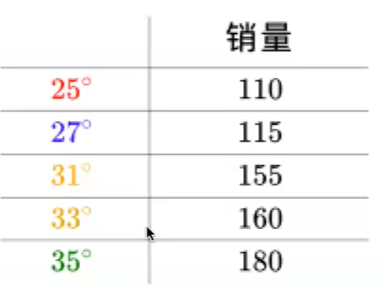

如何度量温度和销量的相关性呢？

1. 这个数是个正数，代表正相关；负数代表负相关
2. 这个数越大，代表相关性就越强

**怎么求相关系数呢？**

利用x减去x的平均数，y减去y的平均数，然后求出协方差，利用协方差再除以每个数的方差，就算出了相关系数~

这是利用数学公式的方法去计算，但实际操作中，我们可以利用**Excel中的函数**来轻松计算相关系数

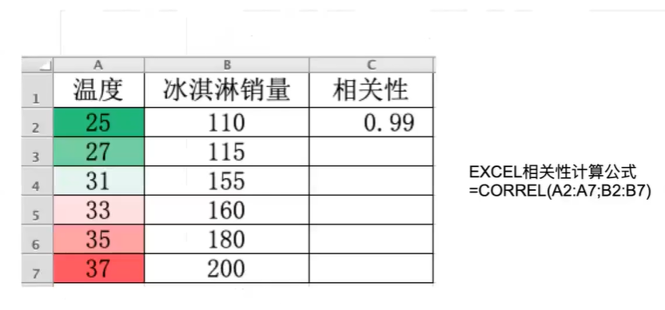

##### 案例分析：

头条是如何通过相关系数优化数据结构，提高推荐质量的？

1. 分词。非结构数据结构化
2. 寻找标题与点击率的相关性
3. 输出规律，提高运营的效率

#### 回归分析

我的理解为：我们可以将我们的业务核心指标Y，而影响业务的有很多相关指标，可以列为X1（可被改变的X）、X2（不可被改变的）、以及残差（不可被解释的因素）

我们用案例来分析：

在这个问题中，在岗时间为需求Y，年龄大、女性、本地户口为X2（不可改变），而这些X可以影响到在岗时长，所以未来的招聘可以着重去考虑从这些方面去招聘从而提升在岗时间的需求。

**案例2：**

以猫眼电影为例子，假设通过回归分析发现，真人真事、IP的作品更容易提升票房，这些就是可变X1，根据回归系数，就可以确认和选择出提升票房的方式。

从前两个例子中，我们可以看出X对于Y的影响。X决定竞争的优势，X越精准，残差越小，Y可被解释的越多。

从下面这个例子，我们可以了解到。

**案例3：**

以抖音为例子，假设为了提高用户观看时长Y，我们设了评论、点赞、分享、时长等用户主动的行为X，但是想要进一步提高播放时长，我们又提出了内容质量的指标，例如：播完率及重复率，这两个X让影响Y的指标更加精准，从而减小了残差，提高了视频的分发质量。

以上就是我对于回归分析的理解，那在我们日常工作中，Y都有些什么呢？

收入、时长、留存、增长、客户满意率、成交率等等.....这些都是我们日常工作中想要去解决的问题。

我们应该提升对产品业务的理解，不断去发现X来改善Y

## 企业回归商业本质

在知识点详细理解之前，我们先代入一个公式：

在我理解下，企业追随的三样东西为：**流量、转化率、商业化**

那么怎么去提升企业获得的利润呢？

下面我们说产品经理的解决方案

#### 增长与裂变：

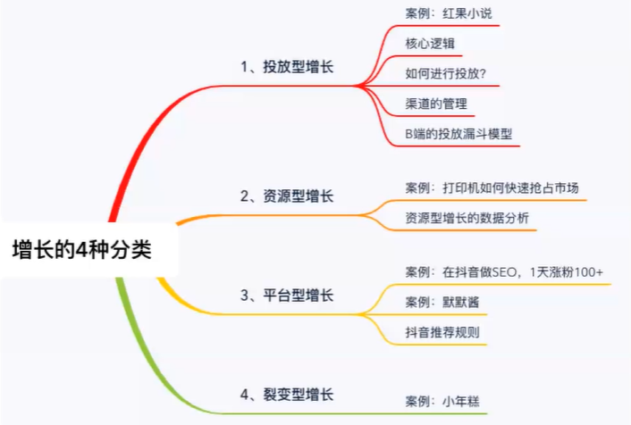

##### 投放型增长：简单来说就是花钱去买用户，买流量。

投放型增长的核心逻辑：**ROI>0**

在这个公式中，小伙伴们就要问了，什么是**ROI**、**LTV、CAC**呢？

**ROI(投资回报率):**计算的方式为  （收入-成本）/投入*100%，大于0即有收入。

**LTV(Life Time Valuie)**:即用户生命周期价值，计算方式看下图。

**CAC(Customer acquisition cost)**:即用户获取成本。

了解了这些，那么如何去进行投放呢？

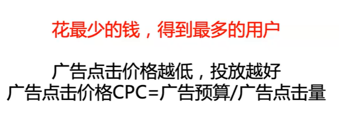

**花最少的钱，得到最多的用户** 。即**CPC**越低，投放越好，得到的利润也更大。

那么，怎么做能让**CPC**的值低呢？

对于广告的投放，我们追求于**低的ECPM（千次曝光价格）**，**高的CTR（点击量）**= **低点击成本**

现在我们大概懂该怎么投放了把？

简单来讲就是，投放 **ROI** 较高的业务线

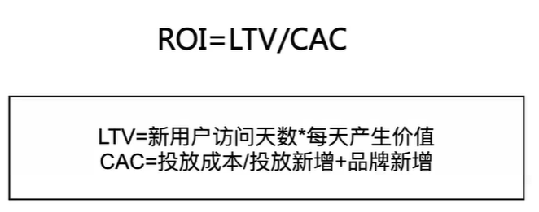

下面有几种投放增长的方式：

1.  **素材的测试**

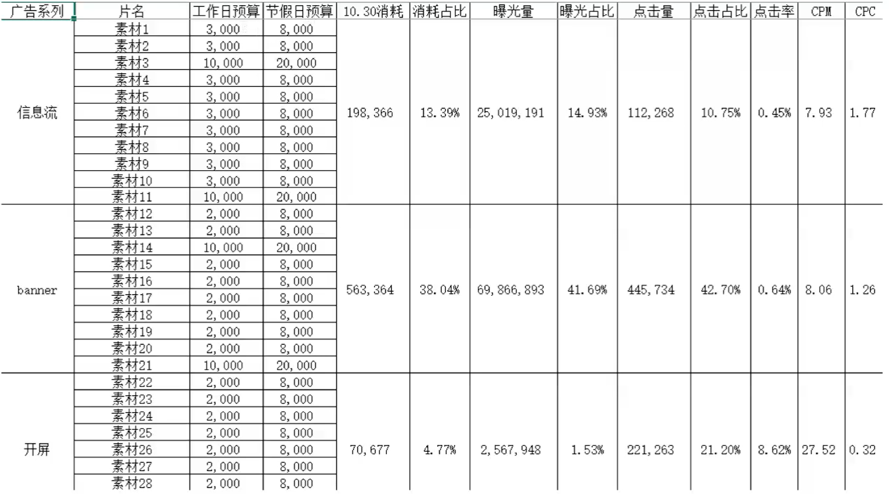

通过各种素材的数据，来分析哪种投放方式是最合理最能把利润最大化的，就可以针对这种方式来加大投入量，从而提升利润。

2.  **渠道的管理**

 根据不同渠道的投放效率以及转化效率，我们可以选择出合适的投放渠道。

**资源型增长**：就是利用手上的资源，去谈合作，宣发产品。

资源型增长是**冷启动**最好的方式，是B端常用的方式。

**例如**：苹果Appstore，首页的推荐banner，还有一些app之间的相互洗量，权益增值，通过互通vip来把同时增长两个平台的用户量。

那么如何思考去进行资源型的增长呢，有以下几种方式推荐给大家：

1.  思考你的产业有哪些上下游
2. 谁会成为你的潜在合作伙伴
3. 如何接触你的合作伙伴
4. 如何建立合作关系

那么资源型增长和投放型增长分别适用于什么情况呢？

我认为，**投放型增长**适用于追求大量的新增用户，**资源型增长**适合手上有资源，与合作伙伴进行资源互换。

**平台型增长：**在大流量的平台上，利用平台的玩法，去获取流量的增长。例如利用抖音高日活量来进行IP的孵化。

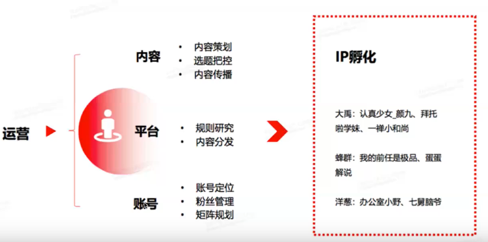

例如：抖音如何去**涨粉**呢？

1. 避免**热门领域**
2. 寻找**用户需求**
3. 罗列一些**热门query词**
4. **优化query词**

这些思维，同样适用于我们产品的增长模式中来。

**裂变型增长：**即利用分享与回流，产生DAU的增长。

假如在裂变增长前，我们的DAU人数为100，在经过**40%的分享率**后，我们得到了**500%的回流率**，即产生了**200的回流量**，此时称产生了**裂变**型增长。

那么在用户的增长后，怎么去激活与留存呢？

下面让我们来看看激活与留存的方式方法

-----------------------------------------------------------------------------------------------分割线-----------------------------------------------------------------------------------------------

#### 激活与留存：

什么叫激活？

什么叫留存呢？

介绍完概念后，我们来看看如何来激活用户

首先我们罗列出一些可能激活用户的关键行为，这些关键行为可以通过回归分析等方法来筛选，最后确定关键行为，进行AB测试，从而选出激活用户的方法。

例子：

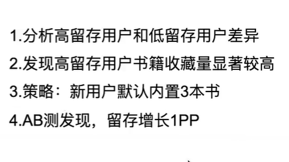

我们以漫画app来进行分析，首先通过高留存与低留存用户的差异来分析出哪些因素可能会影响用户的留存率，然后发现了高留存用户书籍收藏量显著较高，所以实行一种策略来给部分新用户内置3本书来做AB测试，结果发现留存率有所增长。

下面再来看一个例子：

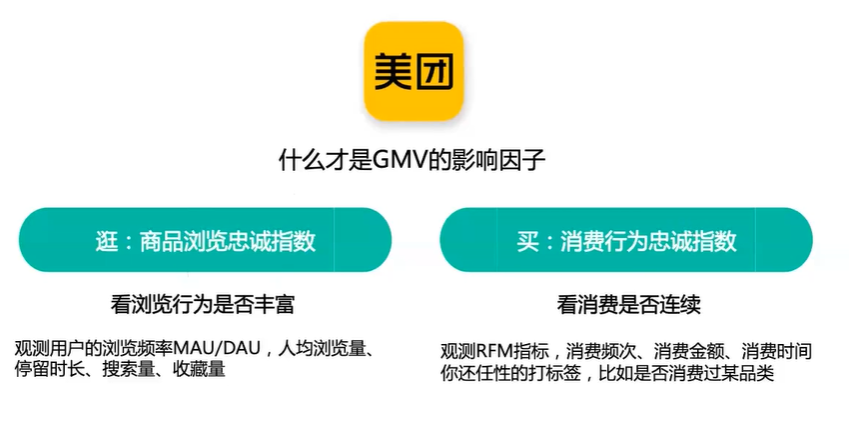

美团经过大量的分析总结了两种影响成交金额（GMV）的因子，并通过这两种因子对用户进行分类整理，

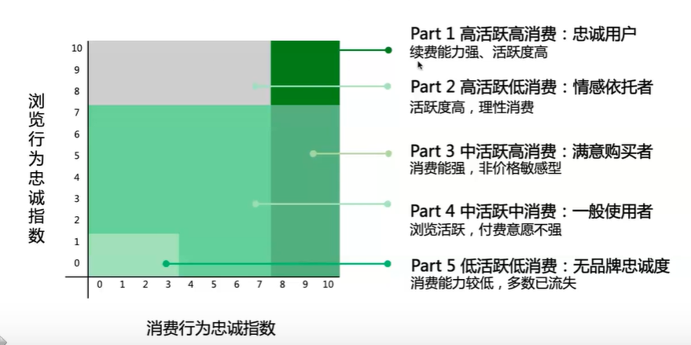

对用户进行了5种分类，通过针对性的运营策略，来激活用户

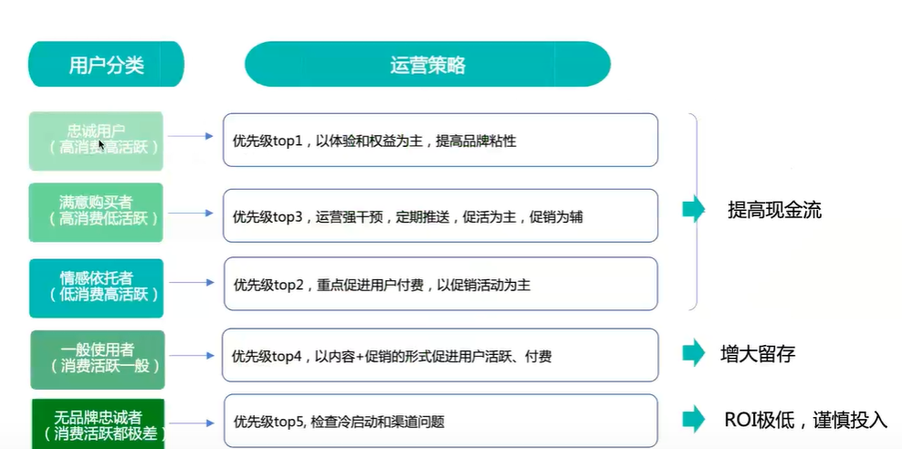

#### 商业化：

什么是商业化呢？我们从下面几个方面来了解商业化。

那我们先从广告主的工作流程讲起吧！

**广告主的工作流程：**

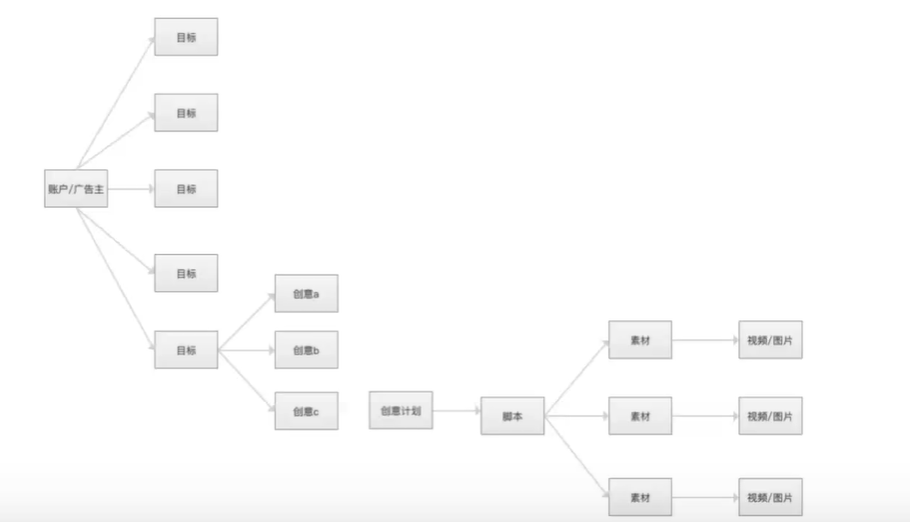

广告主提出很多目标，选定一个目标后，要延伸出不同的创意，例如广告。再根据不同的创意所需要的素材来分出不同的投放方法。

通过不同素材的转化率，来决定加大对哪种素材的投放量，从而获得收益。

例如头条：

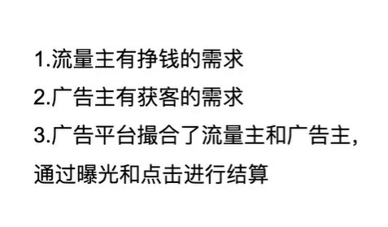

通过流量主的高曝光和点击，来带动广告的宣传和获客。

**广告变现的流程：**

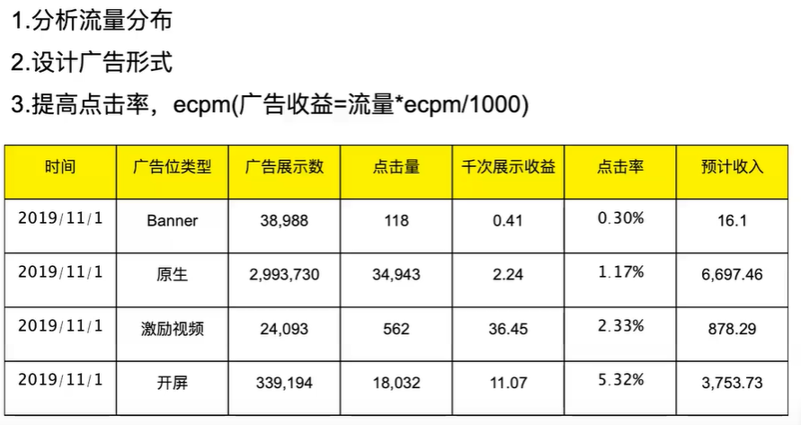

**广告变现的逻辑：**

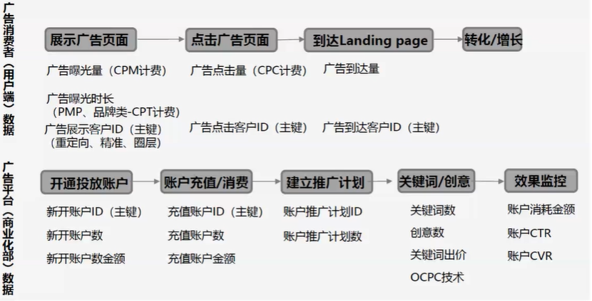

