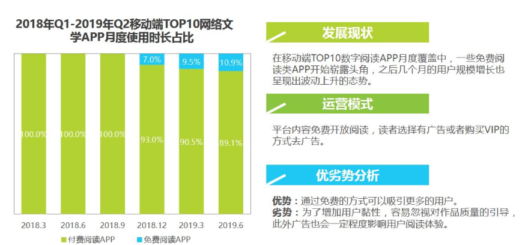
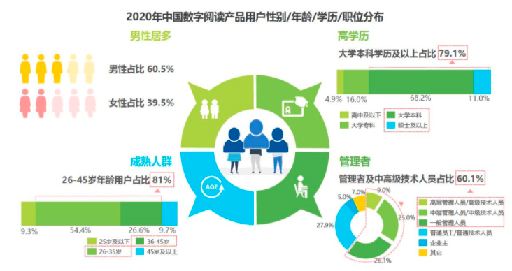
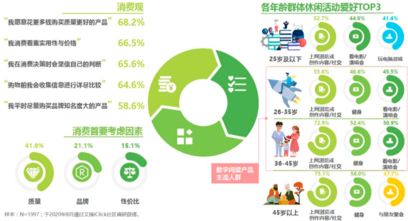

# 番茄小说竞品分析

## 一、分析背景

### （一）、产品概况

##### 		1.产品概述及版本

​	番茄小说是一款免费网文阅读 APP，采用“广告+免费”的模式，为读者提供免费的精彩网文，提供畅快的阅读体验。支持在线阅读、离线下载、兴趣推荐、视频推书、有声书、阅读换金币等多项功能。

​	最新版本：4.0.5

##### 		2.测试环境

- 设备型号：IphoneX
- 操作系统：IOS14
- 测试网络：电信4G

##### 		3.选择理由

​	本人爱好阅读，网文有着十几年的历史，到现在互联网时代市场逐渐变得庞大，网文阅读也从曾经的一家独大到现在的各种模式的竞争，其中字节跳动入局移动阅读后，短短几个月便取得了日活过千万的壮举，便想要去做这款App的竞品分析作为产品经理的学习。

### （二）、市场分析

##### 		1.行业规模

​	2018年中国在线文学市场规模总计达153.5亿元，同比增长20.3%。自2015年以来，优质IP的出现成为产业内生动力，优化了产业发展结构。同时，国家出台了一系列打击网络侵权盗版的政策，并且国家陆续出台了《国家“十三五”时期文化发展改革规划纲要》、《关于开展2018年全民阅读工作的通知》等重大战略规划，并开展优秀网络文学原创作品推介等一系列活动。2019年《政府工作报告》“提倡全民阅读，推进学习型社会建设”。这一系列政策都推动着在线阅读的发展。

##### 		2.用户规模

​	2019年网络文学行业用户规模达4.7亿，同比增长8.8%，用户规模持续增长，在人口红利逐渐消退的影响下，在线阅读用户增长速度呈下降趋势，可预估2020-2021年，用户规模增长速度会进一步放缓，在线阅读行业的用户获得成本会变高。

##### 		3.商业模式

​	在2018下半年，以七猫小说为代表的一批小说APP的崛起，另辟蹊径的开拓免费阅读的运营模式，这一模式使长尾作品有了更多接触用户的机会。不仅是对网络文学全新商业模式的创新开拓与有益探索，也为网文变现打开了一扇新的大门，对整个行业起到了意义非凡的推动作用。

### （三）、用户分析

##### 		1.用户基本信息分析

​	中国数字阅读男女比例相差较大，男性用户偏多，为60.5%，且年龄方面有明显的偏向性，26-45岁年龄用户占比81%。用户普遍具有高学历，本科生及硕士生以上占比79.1%，高学历用户对于阅读的粘性较高。数字阅读用户管理者及中高级技术人员占比60.1%，具有较高的消费能力。根据以上数据分析得出2020年我国数字阅读产品用户普遍为男性，并且高学历成熟社会人群占比较大。

##### 2.用户画像

​	数字阅读产品用户平日休闲活动健康多元，最喜欢健身、看电影与演唱会，逛街购物，生活品质较高；在消费观方面，习惯主动搜索信息做功课，并倾向充当消费决策主导者的角色；在选品时，倾向于购买物有所值的品质商品。

## 二、竞品对象

##### 	1.选择目标

七猫小说：

七猫免费小说是一款提供[小说阅读](https://baike.baidu.com/item/小说阅读/430636)服务的[软件](https://baike.baidu.com/item/软件/12053)。小说内容覆盖了总裁豪门小说、[言情小说](https://baike.baidu.com/item/言情小说/154757)、穿越架空小说、[玄幻小说](https://baike.baidu.com/item/玄幻小说/145698)、青春校园小说、修仙小说、[悬疑小说](https://baike.baidu.com/item/悬疑小说/5683700)、[同人小说](https://baike.baidu.com/item/同人小说/9824319)、名著等各种类型。

##### 	2.选择理由

通过数据对比发现，番茄小说和七猫小说目前在市场上都有较高的占有率，为阅读下载排行的第一名及第三名。对比两个平台在AppStore上的排名也较为接近，大幅领先其他的阅读软件，故选择七猫小说为直接竞品。

## 三、竞品分析

### （一）、定位和功能

##### 1.产品定位

##### 2.产品功能

### （二）、设计和技术

##### 1.交互和体验

##### 2.视觉和风格

##### 3.亮点功能和核心技术

### （三）、运营及商业化

##### 1.运营模式

##### 2.盈利模式

##### 3.市场推广

### （四）、用户数据

##### 1.用户数量和活跃度

##### 2.转化率、健康度

##### 3.在线时长

##### 4.地域差异

### （五）、核心策略分析

##### 1.版本迭代和演变

##### 2.公司战略

### （六）、优缺点总结和借鉴

## 四、总结

